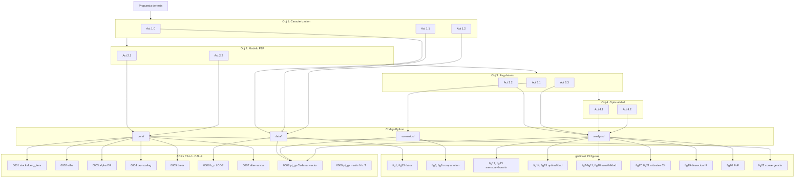

# Matriz de trazabilidad — Objetivo → Código → Evidencia

**Tesis:** Análisis de Optimalidad y Validación Regulatoria de Mercados P2P en Colombia  
**Autor:** Brayan S. Lopez-Mendez | **Asesores:** Andrés Pantoja · Germán Obando  
**Programa:** Maestría en Ingeniería Electrónica, Universidad de Nariño, 2026  
**Fecha:** abril de 2026  
**Rama:** tesis/fase-3-documentacion

---

## Instrucciones de lectura

La tabla vincula cada actividad de la propuesta de tesis (`Documentos/PropuestaTesis.txt`) con:
- los módulos de código que la implementan,
- las figuras y tablas que constituyen su evidencia,
- y el estado de avance actual.

**Estados permitidos:**
- `completado` — implementado, validado con pytest y/o ejecución exitosa.
- `parcial — <razón>` — implementado pero faltan datos o validaciones finales.
- `pendiente` — no iniciado.
- `diferido — <razón>` — fuera del alcance de esta entrega.

---

## Tabla principal

| Objetivo | Actividad | Módulo / archivo | Figura / tabla | Estado | Observaciones |
|---|---|---|---|---|---|
| **1** — Análisis del modelo de referencia | **1.0** — Inventario de elementos del sistema e insumos por escenario | `Documentos/Inventario_Act_1_0.md`; `data/base_case_data.py`; `data/xm_prices.py`; **`data/cedenar_tariff.py`**; **`data/tarifas_cedenar_mensual.csv`**; **`data/cedenar_pdfs/`** (13 PDFs) | — | completado | Inventario formal de 5 escenarios, 6 agentes MTE y parámetros de la Tabla I canónica (Chacón et al., 2025). **CAL-8 (2026-04-28):** calibración Cedenar mensual per-agente reemplaza el escalar 650; cobertura completa abr-2025 → abr-2026 con PDFs respaldatorios |
| **1** | **1.1** — Revisión y consolidación del modelo base | `core/ems_p2p.py`; `core/replicator_sellers.py`; `core/replicator_buyers.py`; `core/market_prep.py`; `tests/validate_base_model.py`; `tests/golden_test_sofia.py` | `graficas/fig22_convergencia_h0013.png`; `graficas/fig22_convergencia_h0683.png` | completado | Replicator Dynamics + Stackelberg implementados. Golden test verifica P_total dentro de atol = 0,15 kWh y pi_i ∈ [PGB, PGS] vs oráculo SLSQP (Bienestar6p.py). Tolerancia rtol = 5 % documentada en `tests/golden_test_sofia.py`. Convergencia ilustrada en fig22a (h0013 caso marginal con W_T positivo) y fig22b (h0683 alta energía con W_T negativo) — renombradas el 2026-04-27 desde fig11_convergencia_h\* tras auditoría visual (§A.8 de notas_modelo_tesis.md) |
| **1** | **1.2** — Inferencia de parámetros mediante revisión bibliográfica y datos reales | `Documentos/Revision_Bibliografica_Act_1_2.md`; `Documentos/references.bib`; `data/base_case_data.py`; `data/xm_prices.py` | Tablas 1.1–1.5 (en `Revision_Bibliografica_Act_1_2.md`) | completado | b_n = 225 COP/kWh (LCOE solar Pasto, IRENA [16]/UPME [17]); ε_p corto plazo −0,20 a −0,47 (LAC, [19][20]); λ_n = 100, θ_n = 0,5, η_i = 0,1 calibrados contra [5][22][25]. **27 fuentes DOI-verificadas vs CrossRef 2026-04-30** (Tier 1.1 deep-research Ruflo): 6 entradas marcadas previamente VERIFICAR fueron corregidas y renombradas (ver `bib_verificacion_2026-04-30.md` y header de `references.bib`) |
| **2** — Modelado de escenarios regulatorios | **2.1** — Estructuración matemática de escenarios C1–C4 | `scenarios/scenario_c1_creg174.py`; `scenarios/scenario_c2_bilateral.py`; `scenarios/scenario_c3_spot.py`; `scenarios/scenario_c4_creg101072.py` | — | completado | C1: créditos 1:1 + excedentes a bolsa (CREG 174/2021 [3]). C2: PPA bilateral precio fijo. C3: exposición total precio bolsa horario. C4: distribución administrativa vía PDE (CREG 101 072/2025 [4]), modo `pde_only` por defecto |
| **2** | **2.2** — Algoritmos de cálculo de métricas | `scenarios/comparison_engine.py`; `core/settlement.py`; `analysis/optimality.py`; `analysis/fairness.py` | `graficas/fig5_comparacion_regulatoria.png`; `graficas/fig6_ganancia_por_agente.png` | completado | SC, SS, IE, Gini, RPE, GDR, **PoF** calculados con convención unificada de `net_benefit` en los 5 escenarios. PoF formal (Bertsimas, 2011 [15]) implementado en `analysis/fairness.py`: `compute_pof()`, `fairness_curve()`; integrado en `ComparisonResult.fairness` y hoja `PoF_Fairness` del Excel |
| **3** — Comparación cuantitativa de desempeño | **3.1** — Gestión y procesamiento de datos empíricos | `data/xm_data_loader.py`; `data/xm_prices.py`; `diagnostico_datos.py` | `graficas/fig1_perfiles.png`; `graficas/fig23_perfiles_diarios.png` | completado | MTE: 5 instituciones (Udenar, Mariana, UCC, HUDN, Cesmag), 6 144 h (abr.–dic. 2025), resolución 1 h, tz `America/Bogota`. Protocolo de limpieza y remuestreo documentado en `data/xm_data_loader.py`. fig1 muestra serie horaria completa; fig23 (agregada el 2026-04-27) muestra perfil diario promedio sobre los 256 días — complementarias |
| **3** | **3.2** — Ejecución de simulaciones comparativas | `main_simulation.py`; `analysis/subperiod.py`; `analysis/p2p_breakdown.py`; `analysis/monthly_report.py` | `graficas/fig3_mercado_p2p.png`; `graficas/fig4_metricas_horarias.png`; `graficas/fig13_desglose_flujos.png`; `graficas/fig16_subperiod.png`; `graficas/fig12_comparacion_mensual.png` | completado | Horizonte completo **6 144 h** ejecutado con MedicionesMTE_v3 (Abr–Dic 2025, 256 días). **Última corrida post-CAL-8: 2026-04-28, 55,2 min** (calibración Cedenar mensual per-agente). 1 031/6 144 h con mercado P2P activo (16,8 %); 3 659,3 kWh transados. Resultados: P2P 52,43 MCOP / C1 54,04 / C4 50,29 / Σ ventaja P2P − C4 = 2,14 MCOP. Sub-períodos SP1–SP4 computados. Reporte mensual en `graficas/fig12_comparacion_mensual.png` |
| **3** | **3.3** — Descomposición del bienestar y comparación monetaria | `scenarios/comparison_engine.py`; `analysis/optimality.py`; `core/settlement.py`; `analysis/fairness.py` | `graficas/fig14_optimalidad_horaria.png`; `graficas/fig15_c1_vs_c4.png`; `graficas/fig20_price_of_fairness.png` | completado | Descomposición monetaria vs. intangibles implementada. **RPE = +0,0408** (horizonte 6 144 h, post-CAL-8 2026-04-28). **PoF = 0,0000** (eficiente y equitativo coinciden = C1, sin tensión). PS = 71,4 % a compradores / PSR = 28,6 % a vendedores. GDR = 1,000 (clearing perfecto). Spread C4 = 1 004,4 kWh. PoF formal (Bertsimas 2011) integrado en `analysis/fairness.py` y visualizado en `fig20_price_of_fairness.png` |
| **4** — Sensibilidad y análisis de optimalidad | **4.1** — Análisis de sensibilidad mediante simulaciones | `analysis/global_sensitivity.py`; `analysis/sensitivity.py`; `analysis/sensitivity_2d.py`; `analysis/subperiod.py`; `scripts/sweep_pgb_pv.py` | `graficas/fig7_sensibilidad_pgb.png`; `graficas/fig8_sensibilidad_pv.png`; `graficas/fig9_factibilidad.png`; `graficas/fig10_sensibilidad_ppa.png`; `graficas/fig11_sensibilidad_pgs.png`; `graficas/fig16_subperiod.png`; `graficas/fig18_heatmap_pgb_pv.png`; `graficas/fig19_desercion_individual.png`; `graficas/fig21_robustez_c4_agente.png` | completado | Cobertura ortogonal de §VI.D: (i) **GSA Sobol-Saltelli** sobre el modelo de referencia (Chacón et al.): 7 parámetros, 3 outputs. **n_base = 128 ejecutado 2026-04-27** (2 048 evaluaciones, 1 367 válidas, modo preciso, 111 min). ST: `factor_PV` (0,66 ganancia / 0,82 SC), `factor_D` (0,44 ganancia), `PGB` (0,99 IE — dominante en equidad). Resultados en `outputs/resultados_gsa.xlsx`. Decisión: `_fast_mode` deprecado por cuelgues de LSODA en samples patológicos. (ii) **Barridos uni-paramétricos sobre MTE_v3**: SA-1/2/3/PPA sobre 6 144 h. (iii) **Sweep 2D PGB×PV** (`fig18_heatmap_pgb_pv.png`, `outputs/sensitivity_2d_pgb_pv.parquet`): mapa conjunto cobertura/precio. (iv) **Deserción individual** por agente (`fig19_desercion_individual.png`). (v) **Subperíodos** SP1–SP4. (vi) **Robustez C4 por agente** (`fig21`). Justificación metodológica en `Documentos/notas_modelo_tesis.md` §A.7. |
| **4** | **4.2** — Análisis cualitativo de optimalidad del equilibrio | `analysis/feasibility.py`; `analysis/optimality.py`; `tests/test_stackelberg_convergence.py`; `tests/statistical_tests.py` | `graficas/fig9_factibilidad.png`; `graficas/fig14_optimalidad_horaria.png`; `graficas/fig17_robustez_c4.png` | completado | Criterio de parada Stackelberg adaptativo validado. **Hallazgo IR post-CAL-8 (2026-04-28):** condición de racionalidad individual ahora 3/5 estables (Mariana, UCC, Cesmag — comerciales) y **2/5 en deserción a C1 (Udenar y HUDN — oficiales)** con umbrales `π_gb^*` de 180 y 233 COP/kWh respectivamente. La heterogeneidad oficial/comercial real cambia la frontera relevante de C4 → C1. Bootstrap previo (n=10 000, MTE_v3 pre-CAL-8): d=0,90; pendiente re-ejecutar con la calibración Cedenar para fijar IC definitivos sobre el delta P2P − C4 actualizado. |

---

## Resumen de cumplimiento por objetivo

| Objetivo | Actividades completadas | Actividades parciales | Total actividades |
|---|---|---|---|
| **1** — Análisis del modelo de referencia | 3 (1.0, 1.1, 1.2) | 0 | 3 |
| **2** — Modelado de escenarios | 2 (2.1, 2.2) | 0 | 2 |
| **3** — Comparación cuantitativa | 3 (3.1, 3.2, 3.3) | 0 | 3 |
| **4** — Sensibilidad y optimalidad | 2 (4.1, 4.2) | 0 | 2 |
| **TOTAL** | **10 / 10 (100 %)** | **0 / 10 (0 %)** | **10** |

**Pendientes de datos y escritura (no bloquean cumplimiento de actividades):**

- **GSA sobre MTE_v3 (diferido — decisión metodológica del 2026-04-26):**
  El GSA Sobol-Saltelli opera por diseño sobre el modelo de referencia (Chacón
  et al., 24 h sintético escalado por `factor_PV` y `factor_D`), no sobre series
  horarias MTE. La cobertura de "datos históricos" exigida por la propuesta
  §VI.D se cumple por los barridos uni-paramétricos sobre MTE_v3
  (`analysis/sensitivity.py`) y el análisis de subperíodos
  (`analysis/subperiod.py`). Justificación completa en
  `Documentos/notas_modelo_tesis.md` §A.7. **Actualización 2026-04-27:** GSA
  re-ejecutado con `n_base = 128` (en lugar del n=64 original); IC más
  estrechos pero todavía cualitativos. Una eventual ejecución con
  `n_base ≥ 256` para IC publicables queda como mejora opcional sujeta a
  petición del comité. La infraestructura `_fast_mode` (commit `19e57cb`)
  fue **deprecada** tras evidenciarse cuelgues de LSODA en samples
  patológicos (~58% del espacio Saltelli); el GSA actual usa modo preciso
  con timeout-wrapper de 45 s (ver `Documentos/notas_modelo_tesis.md` §A.7).
- **LCOE real:** Verificar datasheets de inversores instalados en las 5 instituciones MTE.
- ~~**Referencias:** Confirmar autores de [22][24][26][27] en `Documentos/references.bib`.~~ **CERRADO 2026-04-30** vía auditoría CrossRef (Tier 1.1 Ruflo): 6 entradas corregidas, ver `Documentos/bib_verificacion_2026-04-30.md`.
- **Nivel de tensión real per institución:** confirmar contra factura mensual Cedenar el supuesto NT2 actual del mapeo CAL-8.

---

## Archivos de referencia de este documento

| Archivo | Propósito |
|---|---|
| `Documentos/PropuestaTesis.txt` | Fuente autoritativa de las 10 actividades y sus alcances |
| `Documentos/Inventario_Act_1_0.md` | Evidencia de cumplimiento de Actividad 1.0 |
| `Documentos/Revision_Bibliografica_Act_1_2.md` | Evidencia de cumplimiento de Actividad 1.2 |
| `Documentos/references.bib` | Bibliografía consolidada (27 entradas, formato BibTeX IEEE) |
| `Documentos/notas_modelo_tesis.md` | Decisiones de diseño y justificaciones técnicas |
| `outputs/REPORTE_AVANCES.md` | Resultados numéricos de la última ejecución |
| `README.md` | Instrucciones de reproducibilidad |
| `docs/adr/0001..0008-*.md` | Architecture Decision Records de calibraciones CAL-1..CAL-8 |
| `Documentos/bib_verificacion_2026-04-30.md` | Auditoría CrossRef 2026-04-30 con las 6 correcciones del .bib |
| `Documentos/borrador_cap4_resultados.md` | Borrador estructurado del Capítulo 4 (sintetizado por Tier 1.2 Ruflo) |

---

## Anexo — Architecture Decision Records (ADRs CAL-1..CAL-8)

Cada decisión de calibración tiene un ADR formal en `docs/adr/`. Mapeo
de qué módulo está gobernado por qué ADR:

| ADR | Decisión | Módulos afectados | Actividad propuesta |
|---|---|---|---|
| [0001](../docs/adr/0001-cal1-stackelberg-iters.md) | `stackelberg_iters = 2` | `core/ems_p2p.py` | 2.1 |
| [0002](../docs/adr/0002-cal2-etha.md) | `etha = 0.1` | `core/replicator_buyers.py`, `core/ems_p2p.py` | 2.1 |
| [0003](../docs/adr/0003-cal3-alpha-dr.md) | `alpha_p = 0.20`, `alpha_c = 0.10` | `core/dr_program.py`, `core/ems_p2p.py` | 2.1, 4.1 |
| [0004](../docs/adr/0004-cal4-tau-scaling.md) | `tau_buyers/tau_sellers = 10` | `core/replicator_sellers.py`, `core/replicator_buyers.py` | 2.1 |
| [0005](../docs/adr/0005-cal5-theta.md) | `theta = 0.5` (solo reporting) | `core/ems_p2p.py::seller_welfare`, `buyer_welfare` | 2.1 |
| [0006](../docs/adr/0006-cal6-bn-lcoe-solar.md) | `b_n = 225 COP/kWh` real / vector u.o. sintético | `data/xm_prices.py`, `data/base_case_data.py` | 1.1, 1.2, 2.1 |
| [0007](../docs/adr/0007-cal7-stackelberg-alternancia.md) | Alternancia secuencial vs ODE conjunta | `core/ems_p2p.py:230-244` | 2.1 |
| [0008](../docs/adr/0008-cal8-pi-gs-cedenar.md) | `pi_gs` Cedenar mensual diferenciada per-agente (vector `(N,)`) | `data/cedenar_tariff.py`, `scenarios/_pi_gs.py`, `scenarios/scenario_c{1,2,3,4}_*.py`, `scenarios/comparison_engine.py`, `analysis/monthly_report.py`, `analysis/p2p_breakdown.py` | 1.0, 3.1, 3.2, 3.3 |
| [0009](../docs/adr/0009-cal9-pi-gs-temporal.md) | `pi_gs` matriz `(N, T)` mes a mes — supersede parcial 0008 en `--full` y `--day` | `scenarios/_pi_gs.py` (`as_pi_gs_array`), `scenarios/scenario_c{1,2,3,4}_*.py`, `scenarios/comparison_engine.py`, `analysis/feasibility.py`, `analysis/monthly_report.py`, `main_simulation.py`, `tests/test_pi_gs_temporal.py` | 1.1, 3.1, 3.2, 3.3 |

**Regla de oro:** cualquier modificación futura a un módulo listado
arriba debe acompañarse de una nueva ADR (0010+) que supersede a la
correspondiente, o de una nota explícita en la existente. La memoria
semántica Ruflo (`namespace adr`) recupera estos ADRs por búsqueda
contextual.

**ADR 0009 — Detalle del wiring por modo de ejecución (`main_simulation.py:213`):**

| Modo de `main_simulation.py` | `pi_gs_arg` | Forma | Razón |
|---|---|---|---|
| `--data real --full` | `pi_gs_per_agent_hourly(names, index_full)` | `(N, T_full)` | Cada hora liquida con el CU del mes que la contiene |
| `--data real --day YYYY-MM-DD` | `pi_gs_per_agent_hourly(names, idx_day)` | `(N, 24)` | Liquidación intra-día con CU del mes vigente |
| `--data real` (perfil diario default) | `pi_gs_per_agent` | `(N,)` CAL-8 | El perfil 24 h promedia el horizonte; sin variabilidad temporal |
| Sintético (sin `--data real`) | `grid_params["pi_gs"]` | `float` | Caso uniforme; barridos de sensibilidad |

`scenarios._pi_gs.as_pi_gs_array(pi_gs, N, T)` normaliza al contrato
canónico `(N, T)` con broadcast retro-compatible para los cuatro
casos. `as_pi_gs_vector(pi_gs, N)` se conserva como adaptador para
callers que aún consumen el vector CAL-8 (colapsa la matriz al
promedio temporal).

---

## Anexo — Diagrama de dependencias (Mermaid)



---

## Anexo — Verificaciones automatizables

Comandos que un asesor o auditor puede ejecutar para validar la
trazabilidad sin revisar el código línea por línea:

| Pregunta del asesor | Comando | Resultado esperado |
|---|---|---|
| ¿Tiene cada actividad implementación de código? | `grep -rn "Activity\|Actividad" analysis/ scenarios/ data/ core/` | ≥ 10 hits etiquetados |
| ¿Tienen las figuras siblings .csv/.mat? | `ls graficas/fig*__*.csv \| wc -l` | 44 (.csv) |
| | `ls graficas/*.mat \| wc -l` | 16 (.mat) |
| ¿Pasan todos los tests? | `pytest tests/ -q` | 33/33 verde |
| ¿Está CAL-8 propagada en escenarios? | `grep -l "as_pi_gs_vector" scenarios/` | 5 archivos C1-C4 + comparison_engine |
| ¿Coinciden ADR y código (etha)? | `grep "etha\s*=\s*" core/replicator_buyers.py core/ems_p2p.py` | `0.1` (per ADR 0002) |
| ¿Coinciden ADR y código (stackelberg_iters)? | `grep "stackelberg_iters\s*=" core/ems_p2p.py` | `2` (per ADR 0001) |
| ¿Coinciden ADR y código (alpha_p)? | `grep "alpha_p\s*=" core/dr_program.py core/ems_p2p.py` | `0.20` (per ADR 0003) |
| ¿Tarifa Cedenar tiene cobertura completa? | `head -5 data/tarifas_cedenar_mensual.csv && wc -l data/tarifas_cedenar_mensual.csv` | 130 filas, abr-2025 → abr-2026 |
| ¿Última corrida `--full` está consolidada? | `grep "post-CAL-8" outputs/REPORTE_AVANCES.md` | hits con fecha 2026-04-28 |
| ¿Bib es válido vs CrossRef? | `grep -c VERIFICAR Documentos/references.bib` | 0 entradas activas (solo cabecera explicativa) |

## Anexo — Recuperación semántica vía Ruflo

La trazabilidad también vive en memoria semántica para búsqueda
contextual. 124 entradas distribuidas en namespaces:

```bash
# ¿Qué módulo implementa la actividad X?
npx @claude-flow/cli memory search --query "actividad 4.1 Price of Fairness"
# → adr-* + kg-node-analysis-fairness + kg-edge-doc-propuesta--actividad-4.1--*

# ¿Qué decisión gobierna un parámetro?
npx @claude-flow/cli memory search --query "alpha demand response prosumidores"
# → adr-0003-cal3-alpha-dr (score ~0.7)

# Recorrer impacto de un cambio
npx @claude-flow/cli memory list --namespace knowledge-graph | grep "kg-edge-.*core-ems_p2p"
```

**Re-sembrar al añadir nueva actividad/módulo/figura/ADR:**
```bash
python scripts/seed_ruflo_kg.py    # actualiza grafo
python scripts/seed_ruflo_adr.py   # si añadiste ADR 0009+
```

---

**Última actualización:** 2026-04-30 (Tier 2.1 kg-traverse Ruflo —
añadidos ADRs 0001-0008, diagrama Mermaid y verificaciones
automatizables; cierre del pendiente bibliográfico vía auditoría
CrossRef Tier 1.1).
